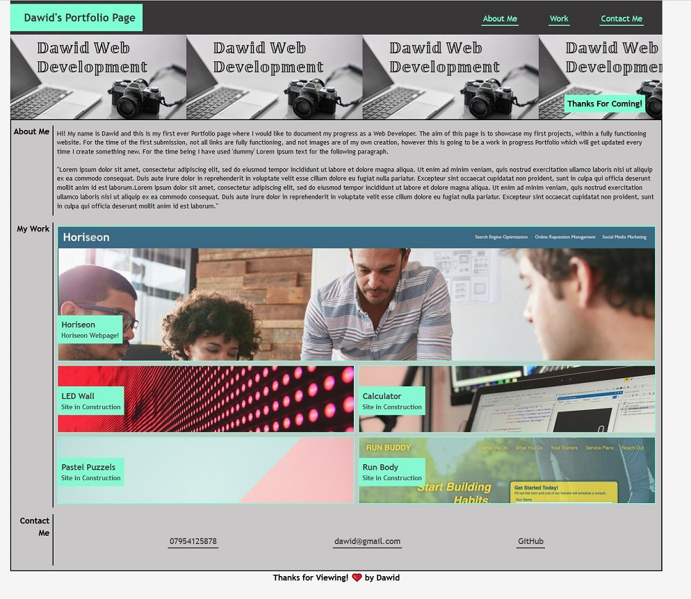

# Unit 2 Challenge: Portfolio

## Table of Contents:
For the ease of navigating around:

* [The Task](#the-task)
* [Acceptance Criteria](#this-was-the-acceptance-criteria-for-the-project)
* [Example Provided](#example-provided)
* [End result](#end-result)
* [Conclusion](#conclusion)
* [Deployment](#deployment)
* [License](#license)

## The Task:

This week's challenge was to create a portfolio page, which I can add to as the course progresses. 

The aim of this portfolio is to showcase my skills to potential future employers, when I start to look for the next stop in my career. It seems that a strong portfolio can be very helpful or even necessary in a modern day setting in order to attract employers, and stand out from competition. Effectively this will be a work in progress portfolio site, as I currently do not have enough to showcase in it, however will add to it as we progress through the Bootcamp.

In this challenge specifically I have applied some of the core skills I have recently learned, including; flexbox/grids, media queries, and CSS variables. Which was a good ground to practice those, which I found to be challenging but very useful and fun at the same time.

**Side Note:** As per the challenge readme file, I did not have enough web applications to showcase at the moment. Thus currently I have only linked my 'Horiseon' web page, but have prepped space for future additions using dummy links and photos, thus everythins is prepared for when I do have the applications.

## This was the acceptance criteria for the project:

* When the page is loaded the page presents your name, a recent photo or avatar, and links to sections about you, your work, and how to contact you
* When one of the links in the navigation is clicked then the UI scrolls to the corresponding section
* When viewing the section about your work then the section contains titled images of your applications
* When presented with the your first application then that application's image should be larger in size than the others
* When images of the applications are clicked then the user is taken to that deployed application
* When the page is resized or viewed on various screens and devices then the layout is responsive and adapts to my viewport

## Example provided:

The following gif was provided in the challenge folder, and the end result had to look similar, however we were given the freedom to use own colors and images;

## End result:

This is a screenshot of what my portfolio website looks like at the time of submitting:

## Conclusion:
This was my first Portfolio with the intent to showcase my work, by all means with a set of guidelines outlined prior to starting which made it a lot more interesting as I got to practice my newly gained skills and knowledge. A very fun and educational activity, which naturally boosted my skills as well as confidence. Which will hopefully come useful in the future challenges to come! I can also already see number of points that could be corrected or improved, however will leave the page as it is and await feedback on what could be improved.

## Deployment:

* Following is a link to the deployed version of the Website: 'https://davvid96.github.io/Dawid-Portfolio-Page/'

## License:

***MIT License*** has been used for the purpose of this challenge. File located in the Repository.